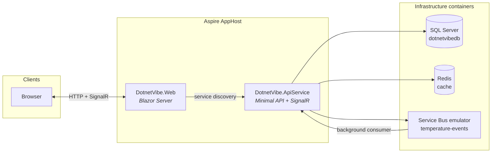

# dotnetVibe

A distributed .NET sample application built with [.NET Aspire](https://learn.microsoft.com/dotnet/aspire/). It demonstrates how a **Blazor** frontend, a **minimal API** backend, and supporting infrastructure work together — with service discovery, caching, messaging, and real-time UI updates.

---

## Overview

dotnetVibe is a learning-oriented scaffold that goes beyond the default Aspire template. The weather demo shows a full request path:

1. The **Web** app loads forecasts from the **API** via Aspire service discovery.
2. The API serves data from **Redis** when cached, otherwise from **SQL Server**.
3. Clicking **Counter** triggers a warm-up event on the **Service Bus** queue.
4. A background worker updates the database, invalidates the cache, and pushes the change to connected browsers through **SignalR**.

---

## Architecture



### Projects

| Project | Role |
|---------|------|
| **DotnetVibe.AppHost** | Aspire orchestrator — starts containers, wires references, and launches services |
| **DotnetVibe.Web** | Blazor Server frontend with interactive components |
| **DotnetVibe.ApiService** | Backend API, EF Core, Redis caching, Service Bus consumer, SignalR hub |
| **DotnetVibe.ServiceDefaults** | Shared Aspire setup — health checks, OpenTelemetry, service discovery, HTTP resilience |

### Infrastructure (local development)

The AppHost provisions these containers automatically:

| Resource | Name | Purpose |
|----------|------|---------|
| SQL Server | `dotnetvibedb` | Persistent weather forecast storage |
| Redis | `cache` | Read-through cache for forecast queries |
| Azure Service Bus emulator | `temperature-events` | Async temperature warm-up events |

Containers use persistent lifetimes and are grouped under the **dotnetVibe** Docker Compose project label for easier management in Docker Desktop.

---

## Tech stack

| Area | Technology |
|------|------------|
| Runtime | .NET 11 (`net11.0`) |
| Orchestration | .NET Aspire 13.4 |
| Frontend | Blazor Server (interactive server render mode) |
| Backend | ASP.NET Core Minimal APIs |
| Data access | Entity Framework Core + SQL Server |
| Caching | Redis via `Aspire.StackExchange.Redis.DistributedCaching` |
| Messaging | Azure Service Bus (emulator in local dev) |
| Real-time | ASP.NET Core SignalR |
| Observability | OpenTelemetry — metrics, tracing, OTLP export |
| API documentation | OpenAPI (development only) |

---

## Prerequisites

- [.NET 11 SDK](https://dotnet.microsoft.com/download)
- [Docker Desktop](https://www.docker.com/products/docker-desktop/) (or another Docker runtime) for SQL Server, Redis, and the Service Bus emulator

---

## Getting started

### Run with the CLI

From the solution root:

```bash
dotnet run --project DotnetVibe.AppHost/DotnetVibe.AppHost.csproj
```

This opens the **Aspire dashboard**, starts the infrastructure containers, and launches both application services. Use the dashboard to open the **webfrontend** endpoint.

### Run from your IDE

Set **DotnetVibe.AppHost** as the startup project and run/debug as usual (Visual Studio, Rider, or VS Code).

> On first run in development, the API applies EF Core migrations automatically.

Client-side libraries under `DotnetVibe.Web/wwwroot/lib/` are restored automatically on build via [LibMan](https://learn.microsoft.com/aspnet/core/client-side/libman/) (`libman.json`).

---

## Application tour

### Web pages

| Route | Description |
|-------|-------------|
| `/` | Home — landing page |
| `/counter` | Increments a counter and posts a warm-up request to the API |
| `/weather` | Displays forecasts from the API; updates live via SignalR when temperatures change |
| `/weather-map` | Geographic map with real Open-Meteo forecast for browser or pinned locations |

### API endpoints

| Method | Path | Description |
|--------|------|-------------|
| `GET` | `/weatherforecast` | Returns cached or database-backed forecasts |
| `GET` | `/weather-map/forecast` | Returns real forecast for latitude/longitude (Open-Meteo) |
| `GET` | `/user/locations` | Lists pinned places for the signed-in user |
| `POST` | `/user/locations` | Creates a pinned place |
| `PUT` | `/user/locations/{id}` | Updates a pinned place |
| `DELETE` | `/user/locations/{id}` | Deletes a pinned place |
| `POST` | `/temperature/warm-up` | Publishes a warm-up event to the Service Bus queue |
| — | `/hubs/weather` | SignalR hub — broadcasts `ForecastUpdated` to connected clients |

### End-to-end warm-up flow

```
Counter page  →  POST /temperature/warm-up  →  Service Bus queue
                                                    ↓
Weather page  ←  SignalR ForecastUpdated  ←  DB update + cache invalidation
```

---

## Health and observability

In development, each service exposes:

| Endpoint | Purpose |
|----------|---------|
| `/health` | Readiness — all health checks must pass |
| `/alive` | Liveness — tagged checks only |

OpenTelemetry is configured in **DotnetVibe.ServiceDefaults**. Set the `OTEL_EXPORTER_OTLP_ENDPOINT` environment variable to export traces and metrics to an OTLP-compatible collector.

---

## Solution structure

```
DotnetVibe/
├── DotnetVibe.AppHost/          # Aspire host and container orchestration
│   └── Extensions/                # Docker Compose project grouping helpers
├── DotnetVibe.ApiService/       # API, EF Core, SignalR, background workers
│   ├── Data/                      # DbContext and entities
│   ├── Hubs/                      # SignalR hubs
│   ├── Migrations/                # EF Core migrations
│   └── Services/                  # Caching, forecasting, messaging
├── DotnetVibe.Web/              # Blazor UI and API/SignalR clients
│   ├── Components/                # Pages, layouts, routing
│   └── Services/                  # SignalR hub client
├── DotnetVibe.ServiceDefaults/  # Shared Aspire service configuration
└── DotnetVibe.sln
```

---

## Learn more

- [.NET Aspire documentation](https://learn.microsoft.com/dotnet/aspire/)
- [Blazor documentation](https://learn.microsoft.com/aspnet/core/blazor/)
- [ASP.NET Core SignalR](https://learn.microsoft.com/aspnet/core/signalr/introduction)
